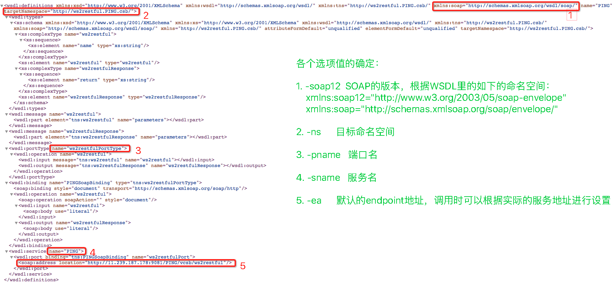
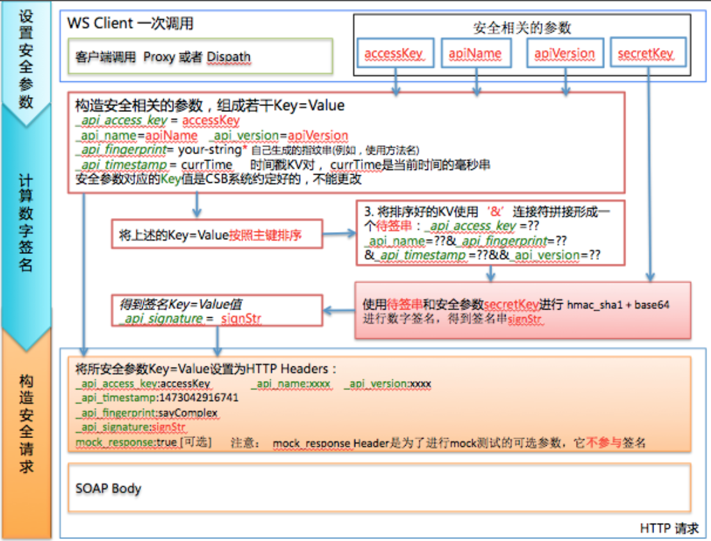

# WS-SDK README

## 1. WS-SDK下载地址


 * 如果使用命令行方式调用SDK,根据需要将standaloned的运行包放在调用端的CLASSPATH环境里  
[最新版本 ws-sdk-1.1.5.11.jar](http://middleware-udp.oss-cn-beijing.aliyuncs.com/components/csb/CSB-SDK/ws-client-1.1.5.11.jar)   
 * 如果用编程的方式使用SDK,则需要将需要的dependency放到你的pom.xml (该依赖已经在maven central repository存在)

 ```
 <dependency>
   <groupId>com.alibaba.csb.sdk</groupId>
   <artifactId>ws-client</artifactId>
   <version>1.1.5.11</version>
 </dependency>
 ```

## 2. WS-SDK功能

当WebService服务由CSB开放出来后，客户端需要生成标准的Proxy或Dispatch来进行调用, SDK的作用是每次调用时做方法拦截把安全需要的KV信息添加到HTTP请求头部分。
程序方式使用SDK编写的方式为：

```
import com.alibaba.csb.sdk.HttpCaller;
import com.alibaba.csb.ws.sdk.WSClientSDK;
...
```

**注意：**在编程方式调用时，首先要在整个JVM范围内启动一次WSClientSDK.warmup()来加载SDK所需要的类,
  否则在第一次调用WSClientSDK时会很慢(~5s)
  
```
//首先使用标准的WS	Client方法获取Proxy或者Dispath
MyPort		proxy	=	...;	
//bind	AK/SK到 proxy上
String	ak	=	"xxxxx";
String	sk	=	"xxxxx";
String	apiName	=	xx;
String	apiVersion	=	xx;
proxy	=	WSClientSDK.bind(proxy,	ak,	sk,	apiName, apiVersion);
//或者设置WSParams参数， SDK1.1.4以后
WSParams params = WSParams.create().accessKey(ak).secretKey(sk).api(apiName).version(version).nonce(true);
proxy	=	WSClientSDK.bind(proxy,	params);

//使用返回的Proxy，调用客户端方法
Response	response	=	proxy.method1(...);	
…
```

## 使用WSInvoker发起调用
```java
public class WSInvokerTest {
    public void test() {
        String nameSpace = "http://xxx.yyy.com/zzzService";
        String serviceName = "zzzService";
        String portName = "zzzServicePortType";
        String soapActionUri = "http://xxx.yyy.com/action1";
        boolean isSoap12 = false;
        String endpoint = "http://localhost:9081/csbTest/1.0.0/ws2ws";
        String reqSoap = "<soapenv:Envelope xmlns:soapenv=\"http://schemas.xmlsoap.org/soap/envelope/\" xmlns:ws2=\"http://ws2ws.csbTest.csb/\">\n" +
                "   <soapenv:Header/>\n" +
                "   <soapenv:Body>\n" +
                "      <ws2:ws2ws>\n" +
                "         <pageSize>10</pageSize>\n" +
                "      </ws2:ws2ws>\n" +
                "   </soapenv:Body>\n" +
                "</soapenv:Envelope>";
        
        WSParams params = WSParams.create().api("csbTest").version("1.0.0").accessKey("ak1").secretKey("sk");
        
        Dispatch<SOAPMessage> dispatch = WSInvoker.createDispatch(params, nameSpace, serviceName, portName, soapActionUri, isSoap12, endpoint);
        SOAPMessage request = WSInvoker.createSOAPMessage(isSoap12, reqSoap);
        
        SOAPMessage response = dispatch.invoke(request);
        System.out.println(response);
    }
}
```

## 3. WSDL的开放说明

根据CSB的设计约定，当CSB开放成WebService服务时，对应的WSDL的地址为如下格式：

a. 如果接入是 HTTP 协议，则开放出的 WSDL 地址是：
```
http://broker-vip:9081/$api_name/$api_version/ws2restful?wsdl
```
  $api_name 为发布的服务名；
  $api_version 为发布的服务版本；
  "ws2restful"为固定值。  
b. 如果接入是 HSF 协议， 则开放出来的 WSDL 地址是：
```
http://broker-vip:9081/$api_name/$api_version/$method?wsdl
```
  $api_name 为发布的服务名；
  $api_version 为发布的服务版本；
  $method 为发布服务时对应的接入方法名。
c. 如果接入是 WS 协议（即WS透传）， 则开放出来的 WSDL 地址是：
```
http://broker-vip:9081/$api_name/$api_version/ws2ws?wsdl
```
  $api_name 为发布的服务名；
  $api_version 为发布的服务版本；
  "ws2ws"为固定值。


## 4.命令方式使用WS-SDK

为了快速测试一个CSB开放出来的WebService服务，WS-SDK工具包提供了命令行方式调用的工具。

### 4.1 命令行工具使用说明

```
$ java -jar ws-client.jar -h
usage: java -jar wsclient.jar [options...]
 -ak <arg>                    accessKey
 -api <arg>                   服务名
 -d,--debug                   打印调试信息
 -ea <arg>                    endpoint地址，e.g:
                              http://broker-ip:9081/api/version/method
 -h,--help                    打印帮助信息
 -ns <arg>                    在wsdl中定义的服务的target namespace
 -pname,--portName <arg>      在wsdl中定义的端口名
 -rd <arg>                    soap请求内容，如果设置该选项时，-rf选项被忽略
 -rf <arg>                    soap请求文件, 文件里定义soap请求的XML内容
 -sk <arg>                    secretKey
 -sname,--serviceName <arg>   在wsdl中定义的服务名
 -soap12                      -soap12 为soap12调用, 不定义为soap11
 -nonce                       如果设置则进行防止重放
 -version <arg>               服务版本
 -action <arg>                SOAPAction，e.g:http://xx.com/abc
 -bizIdKey <arg>              设置bizIdKey(默认:_biz_id)
 -bizId <arg>                 设置bizId值(透传到endpoint)
```

TIP: 你可以使用系统参数-Dtest.stress.times=n 在压测或者限流测试时使用的参数，一次命令行调用可以发起n次调用

TIP: 如何从已知的WSDL中确定上述调用参数

##### 

### 4.2 命令行使用例子

```
java -jar target/ws-client-1.1.4-SNAPSHOT.jar  -ak ak -sk sk -api PING -version vcsb \
  -ea http://11.239.187.178:9081/PING/vcsb/ws2restful \
  -ns http://ws2restful.PING.csb/ -sname PING -pname ws2restfulPortType \
  -action http://xx.yy/abc \
  -rd '<soapenv:Envelope xmlns:soapenv="http://schemas.xmlsoap.org/soap/envelope/" xmlns:test="http://ws2restful.PING.csb/">
<soapenv:Header/>
<soapenv:Body>
   <test:ws2restful>
      <name>abc</name>
   </test:ws2restful>
</soapenv:Body>
</soapenv:Envelope>'

```

如果不使用-rd选项，可以把请求内容保存到一个文件中，然后使用-rf 指定这个文件。

**注意：**命令行方式不支持调用附件或者MTOM形式的WSDL服务

## 5. Web Service SDK的签名实现细节
1. Web Service SDK本身不能代替Client端的调用存根（即Dispatch 或者Proxy），所以首先用户需要使用Web Service标准的客户端工具生成Client端的调用存根；
2. 使用Web Service SDK 提供的方法将调用服务需要的AccessKey, SecrectKey, ApiName, ApiVersion, 时间戳，指纹等信息以及通过这些信息生成的签名设置到Client端存
根上(即：Proxy，Dispatch)；
3. 使用处理过的客户端Proxy（或者Dispatch）发送请求服务时，Web Service SDK会将需要传送的安全和签名信息添加到HTTP Header中，并把这些信息传递给服务提供端进行鉴权和验签。
4. 经过SDK处理后的HTTP请求中会包含如下的Header信息:

```
_api_access_key:abc
_api_name:api-name
_api_version:1.0.0
_api_timestamp:1473042916741
_api_fingerprint:sayComplex
_api_nonce:12121212    //注意： SDK 1.1.4后支持， 防止重放处理
_api_signature:AAAF/e2Scg/vv6PWRl1X/0RgRcQ=
mock_response:true [可选]
```

5. 签名相关的公共HTTP Header包括: _api_access_key, _api_name, _api_version,_api_timestamp, _api_fingerprint, _api_signature。其中api_signature是根据SOAP Header里另外的三个Header组成的key=value格式，并按照key 的名
称字典排序，然后把相应的key=value使用&拼接成规范串(即，_api_access_key=xxxxx&api_name=xxx&_api_fingerprint=xxxx&api_timestamp=xxxx&_api_version=xxxx)；
mock_response是一个特殊的header, 通常在接口测试时候使用，当设置为true时，使Web Service 调用直接返回服务定义时候声明的Mock Soap Response，而不去调用后端真正的接入服务。

6. WS SDK签名处理的图示：


-----------

## 6. Trace
### CmdHttpCaller
#### 设置bizIdKey
-bizIdKey $bizid，默认为_biz_id
#### 设置bizId
* -bizId e48ffd7c1e7f4d07b7fc141f43503cb1
* -H '$bizid:e48ffd7c1e7f4d07b7fc141f43503cb1'
* -H优先于-bizId
```
java -jar http-client-1.1.5.5.jar \
-api item.hsf.add -version 1.0.0 -method post \
-bizIdKey bizid -bizId e48ffd7c1e7f4d07b7fc141f43503cb2 \
-D "item={\"itemName\":\"benz\",\"quantity\":10}" \
-url http://csb.broker.server:8086/CSB
```

### HttpCaller
#### 设置bizIdKey
```
static {
    WSClientSDK.bizIdKey(BIZID_KEY); //不使用默认设置_biz_id时调用
}
```
#### 设置bizId
bizId(x)方法，建议使用
     该方法适用于一个完整请求的各个环节（一个请求可能调用多次csb）

* 作为请求发起方调用该方法会设置bizId
* 在中间环节调用该方法不会覆盖最初设置的bizId
```
WSParams wsparam = WSParams.create()
    .bizId(BIZ_ID)
```
setBizId(x)方法，不建议使用
    该方法会覆盖原有bizId，不适合中间环节调用（除非确实要更改bizId，这样没法串联完整请求流程）

#### web
* web.xml引入trace filter
```
<filter>
    <filter-name>TraceFilter</filter-name>
    <filter-class>com.alibaba.csb.trace.TraceFilter</filter-class>
</filter>
<filter-mapping>
    <filter-name>TraceFilter</filter-name>
    <url-pattern>/*</url-pattern>
</filter-mapping>
```
* 调用trace api
```
wsparam.trace(request)
wsparam.setRequest(request).trace()
```
#### EDAS
引入trace-eagleeye包
```
<dependency>
    <groupId>com.alibaba.csb.trace</groupId>
    <artifactId>trace-eagleeye</artifactId>
    <version>${http.sdk.version}</version>
</dependency>
```

### 日志输出
#### 引入log4j
name限制为CSBSDK，e.g. log4j2.xml
```
<?xml version="1.0" encoding="UTF-8"?>
<configuration status="WARN" monitorInterval="30">
  <appenders>
    <File name="csbsdk" fileName="logs/csbsdk.log">
      <PatternLayout pattern="%m%n"/>
    </File>
    <Async name="async">
      <AppenderRef ref="csbsdk"/>
    </Async>
  </appenders>

  <loggers>
    <logger name="CSBSDK" level="INFO" additivity="false">
      <appender-ref ref="async" />
    </logger>
  </loggers>
</configuration>
```
#### 日志格式
```
startTime|endTime|cost|HTTP/WS|localhost|dest|bizId|requestId|traceId|rpcId|api|version|ak|sk|method|ur|httpcode|httpreturn|msg
1559179173797|1559179173850|53|HTTP|30.25.90.40|csb.target.server|1e195a2815591791594031001d6512|1e195a2815591791737961004d6512|1e195a2815591791737961005d6512|0|item.hsf.remove|1.0.0|||GET|http://csb.target.server:8086/CSB|200|HTTP/1.1 200 OK|
1558949495655|1558949497782|62|WS|30.25.90.39|csb.target.server|1e195a2715589494944221001d5b76|1e195a2715589494954281002d5b76|1e195a2715589494969271003d5b76|0|item.dubbo.add|1.0.0|||add|http://csb.target.server:9081/item.dubbo.add/1.0.0/add|200||
```
### 获取Trace
* TraceFilter  
  TraceFactory.getTraceData()  
* EDAS  
  EagleEye.getTraceId()  
  EagleEye.getRpcId()  
  EagleEye.getUserData($bizIdKey)  
  EagleEye.getRequestId()  
* HTTP/WS  
  request.getHeader(TraceData.TRACEID_KEY)      //_inner_ecsb_trace_id  
  request.getHeader(TraceData.RPCID_KEY)        //_inner_ecsb_rpc_id  
  request.getHeader(HttpCaller.bizIdKey())      //设置的bizIdKey  
  request.getHeader(REQUESTID_KEY)              //_inner_ecsb_request_id  
* HSF  
  EagleEye.getTraceId()  
  EagleEye.getRpcId()  
  EagleEye.getUserData($bizIdKey)  
  EagleEye.getRequestId()  
* Dubbo  
  RpcContext.getContext().getAttachment("_inner_ecsb_trace_id")  
  RpcContext.getContext().getAttachment("_inner_ecsb_rpc_id")  
  RpcContext.getContext().getAttachment($bizIdKey)  
  RpcContext.getContext().getAttachment("_inner_ecsb_request_id")  

## 7. 其他
### 7.1 使用Aixs的Call客户端时的安全信息设定
com.alibaba.csb.ws.sdk.AxisCallWrapper类的介绍

```
 Axis客户端Call的wrapper类， 用以在发送soap请求前，将CSB所要求的签名信息存放到http header里， 具体用法：
 
   //设置服务调用的安全信息
   String apiName = "PING";  //要调用的服务名称
   String apiVersion = "vcsb.ws";  //要调用的服务版本
   String ak = "xxxx"; //订购服务的accessKey
   String sk = "xxxx"; //订购服务的secrectKey
   
   Service service = new Service();
   // 首先，构造封装Call对象
   Call call = AxisCallWrapper.createCallWrapper(service, ak, sk, apiName, apiVersion); 
   或者使用WSParams进行参数设置
   
   // 然后，使用封装Call对象进行方法调用
   call.setTargetEndpointAddress("http://localhost:9081/PING/vcsb.ws/ws2ws");
   call.setOperationName(new QName("http://hc.wsprocess.csb.alibaba.com/", "ping"));
   
   call.addParameter("arg0", // 设置要传递的参数
    org.apache.axis.encoding.XMLType.XSD_STRING, javax.xml.rpc.ParameterMode.IN);
   
   Object[] args = { "wiseking" };
  
   Object ret = call.invoke(args);
   System.out.println("ret=" + ret);
 
 注意，如果要正确使用这个类，需要在你的WSClientSDK编译和运行环境中包含axis依赖， 如：
 
 <dependency>
    <groupId>axis</groupId>
    <artifactId>axis</artifactId>
    <version>1.4</version>
  </dependency>

  <dependency>
    <groupId>org.apache.axis</groupId>
    <artifactId>axis-jaxrpc</artifactId>
    <version>1.4</version>
  </dependency>
  
```


